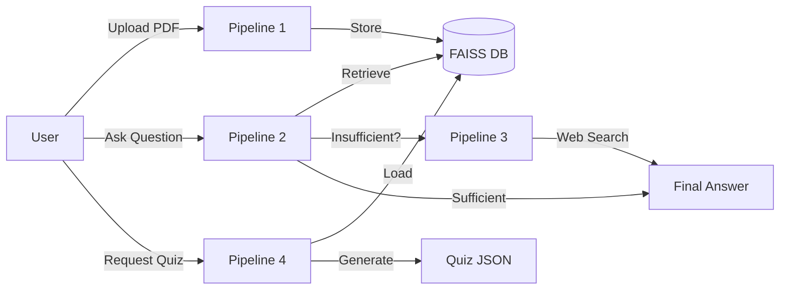
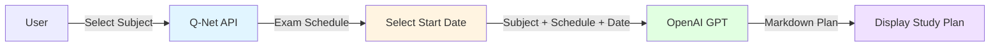

# **LLM API를 활용한 국가 자격증 시험 학습 보조 챗봇 Q-PASS**
본 프로젝트는 OpenAI, Gemini 등 최신 대규모 언어 모델(LLM) API를 활용하여 국가 자격증을 준비하는 사용자의 학습 효율을 높이는 보조 챗봇 프로토타입을 개발합니다. 사용자가 제공한 PDF 문서를 기반으로 **요약, Q&A, 문제 생성, 관련 자료 추천** 등 핵심적인 학습 지원 기능을 제공하는 것을 목표로 합니다.

- **프로젝트 기간:** 2025.11.06 ~ 2025.11.12 (총 1주일)
- **프로젝트 시행:** 커널 아카데미 AI 심화 과정
<!--
- **배포 링크:** [서비스 바로가기](링크 입력) *(배포 완료 후 추가 예정)*
-->

---

## **1. 서비스 구성 요소**
### **1.1 주요 기능**
- **요약 및 Q&A 자동 생성:** 사용자가 입력한 문서를 지정된 분량으로 요약하고, 문서 내용에 기반한 사용자의 질문에 답변을 생성합니다.
- **맞춤형 과제/시험 문제 생성:** 문서 내용을 기반으로 기출 문제와 유사한 형태의 객관식 문제를 자동 생성하여 사용자의 이해도 점검을 돕습니다.
- **학습 자료 추천:** 문서의 핵심 키워드를 분석하여 심화 학습에 도움이 될 만한 관련 자료(도서, 블로그, 웹 페이지 등)를 추천합니다.
- **학습 플랜 자동 생성:** 준비하려는 자격증 시험 일정을 불러와 남은 기간동안의 학습 플랜을 자동으로 생성합니다. 

### **1.2 사용자 흐름**
- **사용자 시나리오 예시:**
  1. 사용자가 학습할 문서(PDF 파일)를 웹 UI에 업로드합니다.
  2. 사용자는 '학습 자료 분석' 탭 내 'Q&A' 기능을 통해 챗봇에게 문서 기반 핵심 내용 요약, 질문에 대한 답변 생성, 추가 자료 탐색을 요청합니다.
  3. 사용자는 '학습 자료 분석' 탭 내 '퀴즈' 기능을 통해 문서에 기반하여 생성된 기출 문제와 유사한 객관식 문제를 받습니다. (4지 선다)
  4. 사용자는 '학습 계획' 탭에서 준비하려는 시험과 응시 일정, 준비 시작 일자를 선택한 후 남은 기간에 맞는 학습 플랜을 받습니다. 

---

## **2. 활용 장비 및 협업 툴**

### **2.1 활용 장비**
- **개발 환경:** macOS 기반 개인 PC
- **서버 환경:** Local 환경 구동

### **2.2 협업 툴**
- **소스 관리:** GitHub
- **프로젝트 관리:** Notion
- **커뮤니케이션:** Slack
- **버전 관리:** Git

---

## **3. 최종 선정 AI 모델 구조**
- **모델 이름:** **OpenAI GPT-3.5-turbo**, **Gemini-2.5-flash**
- **구조 및 설명:** 본 프로젝트는 사전 학습된 LLM을 API 형태로 호출하여 사용합니다. 모델을 직접 학습하는 대신, **프롬프트 엔지니어링**을 통해 각 기능(요약, Q&A, 문제 생성)에 최적화된 결과물을 얻도록 제어하는 데 중점을 둡니다.
- **학습 데이터:** 사용자가 직접 입력하는 PDF 파일(비정형 데이터)이 AI 모델의 주요 입력값으로 활용됩니다. 해당 입력값은 적절한 파싱 이후 OpenAI API의 text-embedding-3-small 모델과 FAISS 모델을 통해 벡터DB 형태로 활용됩니다.
<!--
- **평가 지표:** 기능 요구사항 충족 여부를 기준으로 하며, 생성된 결과물(요약, 질문, 문제 등)의 **정확성, 일관성, 유용성**을 정성적으로 평가합니다.
-->

---

## **4. 서비스 아키텍처**
### **4.1 시스템 구조도**
사용자 인터페이스(Streamlit)에서 입력을 받아 백엔드 서버(FastAPI)로 전달하고, 서버는 외부 LLM API와 통신하여 결과를 다시 사용자에게 보여주는 간단한 3-Tier 아키텍처를 따릅니다.
```
+------------------+      +---------------------+      +-----------------+
|   User (Client)  | <--> |   Backend Server    | <--> |  External LLM   |
|  (React / CSS)   |      | (FastAPI / Python)  |      | (OpenAI/Gemini) |
+------------------+      +---------------------+      +-----------------+
```

### **4.2 데이터 흐름도**
#### 🤖 RAG 기반 챗봇 (요약, 문제 생성 등)
##### Overview


##### Detailed Workflows

<details>
<summary><b>Pipeline 1: PDF to Vector Storage</b></summary>

**Purpose:** PDF 문서를 벡터 DB에 저장하여 검색 가능하게 만듦

**Steps:**
1. 📤 Gemini File API로 PDF 업로드
2. 📄 PyPDF2/Gemini로 텍스트 추출
3. ✂️ LangChain RecursiveCharacterTextSplitter (chunk_size: ~1000)
4. 🧮 OpenAI Embeddings 생성
5. 💾 FAISS VectorDB 인덱싱 및 저장

**Tech Stack:** `Gemini File API`, `PyPDF2`, `LangChain`, `OpenAI`, `FAISS`

</details>

<details>
<summary><b>Pipeline 2: RAG-based Answer Generation</b></summary>

**Purpose:** 저장된 문서에서 관련 정보를 검색하여 답변 생성

**Steps:**
1. 🔍 FAISS similarity search (top_k=5)
2. 🤖 Gemini로 컨텍스트 기반 답변 생성
3. ✅ `[SEARCH_NEEDED]` 태그 확인
   - 정보 충분 → 답변 반환
   - 정보 부족 → Pipeline 3 실행

**Tech Stack:** `FAISS`, `Gemini API`

</details>

<details>
<summary><b>Pipeline 3: Web-Augmented Response</b></summary>

**Purpose:** 웹 검색으로 최신/추가 정보를 보강

**Steps:**
1. 🌐 Tavily Search API로 웹 검색
2. 📑 검색 결과 포맷팅 및 필터링
3. 🤖 Gemini로 최종 통합 답변 생성

**Tech Stack:** `Tavily API`, `Gemini API`

</details>

<details>
<summary><b>Pipeline 4: Document-based Quiz Generation</b></summary>

**Purpose:** 업로드된 PDF 문서 기반 학습용 퀴즈 자동 생성

**Steps:**
1. 💾 FAISS VectorDB에서 문서 청크 로딩
2. 🤖 Gemini API로 퀴즈 생성 요청 (JSON 포맷 지정)
3. 📋 JSON 응답 파싱 및 검증

**Output Format:**
```json
{
  "quiz": [
    {
      "question": "문제 내용",
      "options": ["선택지1", "선택지2", "선택지3", "선택지4"],
      "answer": 0,
      "explanation": "해설"
    }
  ]
}
```

**Tech Stack:** `FAISS`, `Gemini API`, `JSON Parser`

</details>

<br>

#### 📝 학습 플랜 생성

##### Overview


##### Detailed Workflows

<details>
<summary><b>1. Load Exam Schedule via Q-Net API</b></summary>

**Purpose:** 선택한 종목의 필기/실기 시험 일정 조회

**Process:**
1. 사용자가 자격증 종목 선택
2. Q-Net OpenAPI로 시험 일정 요청 (원서접수, 시험일, 합격발표일)
3. XML 응답 파싱 후 화면에 표시

**Tech Stack:** `Q-Net OpenAPI`, `FastAPI`, `XML Parser`

</details>

<details>
<summary><b>2. AI Study Plan Generation</b></summary>

**Purpose:** 시험 일정과 시작일 기반 맞춤형 학습 계획 생성

**Input:**
- 자격증 종목명
- 시험 일정 (필기/실기 시험일)
- 사용자가 선택한 학습 시작일

**Process:**
1. 학습 기간 자동 계산 (시작일 → 필기시험일, 필기 합격발표 → 실기시험일)
2. 주차별 학습 일정 생성
3. OpenAI GPT로 구체적인 학습 계획 생성 요청
4. Markdown 형식의 학습 계획 반환

**Output:** 주차별/일별 학습 내용이 포함된 구조화된 학습 계획

**Tech Stack:** `OpenAI GPT-3.5-turbo`, `ReactMarkdown`, `DatePicker`

</details>

<!--
1.  **사용자 입력:** 사용자가 UI를 통해 준비 중인 자격증 시험에 관한 pdf 문서를 입력합니다.
2.  **백엔드 요청:** Frontend(React)는 입력된 텍스트를 Backend(FastAPI) API로 전송합니다.
3.  **프롬프트 구성:** 백엔드는 사전에 설계된 프롬프트 템플릿에 사용자 텍스트를 결합합니다.
4.  **LLM API 호출:** 완성된 프롬프트를 OpenAI 또는 Claude API로 전송합니다.
5.  **결과 수신 및 파싱:** LLM이 생성한 응답(JSON, Bullet 형식)을 수신하여 파싱합니다.
6.  **결과 반환:** 파싱된 데이터를 UI가 표현하기 좋은 형태로 가공하여 Frontend로 반환합니다.
-->

---

## **5. 사용 기술 스택**
### **5.1 백엔드**
- **Framework:** FastAPI (Python)
- **LLM API:** OpenAI, Gemini
- **External API:** Q-Net OpenAPI, Tavily

### **5.2 프론트엔드**
- **Framework:** React, CSS

### **5.3 머신러닝 및 데이터 분석**
- **LLM Libraries:** `openai`, `gemini`

<!--
### **5.4 배포 및 운영**
- **Runtime Environment:** Python 3.9+
- **Containerization:** Docker (선택 사항)
-->

---

## **6. 팀원 소개**

|  |  |  | 
| :--------------------------------------------------------------: | :--------------------------------------------------------------: | :--------------------------------------------------------------: |
|            [기유진](https://github.com/YujinKi)             |            김종주             |            오화영             |

<!--
|  |  |  | 
| :--------------------------------------------------------------: | :--------------------------------------------------------------: | :--------------------------------------------------------------: |
|            [기유진](https://github.com/)             |            [김종주](https://github.com/)             |            [오화영](https://github.com/)             |
-->

---

## **7. Appendix**
### **7.1 참고 자료**
- **API 문서:** [OpenAI API Reference](https://platform.openai.com/docs/api-reference), [Gemini API Documentation](https://ai.google.dev/gemini-api/docs)
- **프레임워크:** [FastAPI 공식 문서](https://fastapi.tiangolo.com/)
- **프롬프트 가이드:** [OpenAI Prompt Engineering Guide](https://platform.openai.com/docs/guides/prompt-engineering)

### **7.2 설치 및 실행 방법**
1.  **Repository 클론:**
    ```bash
    git clone [https://github.com/your-repo/your-project.git](https://github.com/your-repo/your-project.git)
    cd your-project
    ```

2.  **가상환경 생성 및 활성화:**
    ```bash
    python -m venv venv
    source venv/bin/activate  # Windows: venv\Scripts\activate
    ```

3.  **필수 라이브러리 설치:**
    ```bash
    pip install -r requirements.txt
    ```
4.  **.env 파일 생성 및 API 키 설정:**
    - 프로젝트 루트에 `.env` 파일을 생성하고 아래 내용을 추가합니다.
    ```
    QNET_SERVICE_KEY="YOUR_QNET_SERVICE_KEY"
    OPENAI_API_KEY="YOUR_OPENAI_API_KEY"
    GEMINI_API_KEY="YOUR_GEMINI_API_KEY"
    TAVILY_API_KEY="YOUR_TAVILY_API_KEY"
    ```

5.  **애플리케이션 실행:**
    ```bash
    streamlit run app.py
    ```
    
